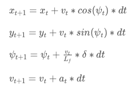

# CarND-Controls-MPC
Self-Driving Car Engineer Nanodegree Program
---

In this project you'll implement Model Predictive Control to drive the car around the track. This time however you're not given the cross track error, you'll have to calculate that yourself! Additionally, there's a 100 millisecond latency between actuations commands on top of the connection latency.

## The Model

We use the Kinematic model that defines the state as the `(x,y)` position, the velocity `v` and the orientation `ψ`. The actuators are the acceleration `a` and the steering control ```𝛿```. The state transition after a time interval `dt` is defined by the following equations:



To complete our state vector, we add the **cross track error (cte)** (distance between the lane center and the vehicle's position) and **orientation error (eψ)**, so that our final state vector is `[x,y,ψ,v,cte,eψ]`.

The kinematic model equations are used as constraints for our optimization problem, solved using the [Ipopt](https://projects.coin-or.org/Ipopt/) library. The code for these constraints can be found in the [MPC.cpp](./src/MPC.cpp) file:

```
fg[1 + x_start + t] = x1 - (x0 + v0 * CppAD::cos(psi0) * dt);
fg[1 + y_start + t] = y1 - (y0 + v0 * CppAD::sin(psi0) * dt);
fg[1 + psi_start + t] = psi1 - (psi0 + (v0/Lf) * delta0 * dt);
fg[1 + v_start + t] = v1 - (v0 + a0 * dt);
            
Eigen::VectorXd coeffs_d(coeffs.size()-1);
// coefficients for polynomial derivative            
for (int i = 1; i < coeffs.size(); i++) {
   coeffs_d[i-1] = coeffs[i] * i;
}
            
AD<double> psi_des0 = CppAD::atan(polyeval_cppad(coeffs_d, x0));
            
fg[1 + cte_start + t] = cte1 - ((polyeval_cppad(coeffs, x0) - y0) + v0 * CppAD::sin(epsi0) * dt);
fg[1 + epsi_start + t] = epsi1 - ((psi0 - psi_des0) + (v0/Lf) * delta0 * dt);
```

### Tuning the model

To get a smooth and safe driving we have to define different weights for the error, velocity, steering, acceleration and steering/acceleration change costs. The following code implements these weights for a target velocity of **100mph**:

```
// Weights for each cost
const int cte_cost_weight = 3000;
const int epsi_cost_weight = 3000;
const int v_cost_weight = 1;
const int delta_cost_weight = 1;
const int a_cost_weight = 1;
const int delta_change_cost_weight = 1;
const int a_change_cost_weight = 1;

// Cost for CTE, psi error and velocity
for (int t = 0; t < N; t++) {
    fg[0] += cte_cost_weight * CppAD::pow(vars[cte_start + t], 2);
    fg[0] += epsi_cost_weight * CppAD::pow(vars[epsi_start + t], 2);
    fg[0] += v_cost_weight * CppAD::pow(vars[v_start + t] - ref_v, 2);
}

// Costs for steering (delta) and acceleration (a)
for (int t = 0; t < N-1; t++) {
    fg[0] += delta_cost_weight * CppAD::pow(vars[delta_start + t], 2);
    fg[0] += a_cost_weight * CppAD::pow(vars[a_start + t], 2);
}

// Costs related to the change in steering and acceleration (makes the ride smoother)
for (int t = 0; t < N-2; t++) {
    fg[0] += delta_change_cost_weight * pow(vars[delta_start + t + 1] - vars[delta_start + t], 2);
    fg[0] += a_change_cost_weight * pow(vars[a_start + t + 1] - vars[a_start + t], 2);
}
```

## Timestep Length and Elapsed Duration (N & dt)

After trying many combinations of values for `N` and `dt` we can conclude that:
* A prediction of 1 second ahead is a good choice for safe driving (`N=10` and `dt=0.1`, for example).
* When you choose a too small (say 0.01) or too large value for `dt` the vehicle becomes unstable.
* When you choose a too small value for `N` the vehicle slowly goes out of the track.

### The trick: variable `dt`

The problem with using a fixed number of prediction steps and time interval is that the prediction spans a much larger distance when driving at high speeds. To keep the model accurate at higher speeds, we ajust the `dt` value using the velocity, as shown below:

```
AD<double> dt = 0.1;
            
if (v0 > 10.) {
   dt = 5./v0;
}
```

With this simple tuning step, the car can drive safely at speeds as high as 97mph.

## Polynomial Fitting and MPC Preprocessing

Since the waypoints received from the simulator use a global coordinate system, we need to convert these points to the car coordinate system. This is implemented in `main.cpp` as follows:

```
for (int i=0; i< ptsx.size(); i++) {
   double x_ = ptsx[i] - px;
   double y_ = ptsy[i] - py;
   ptsx_car[i] = x_ * cos(-psi) - y_ * sin(-psi);
   ptsy_car[i] = x_ * sin(-psi) + y_ * cos(-psi);
}
```

Transforming these waypoints make it easier to both display them and to calculate the CTE and Epsi values for the model predictive controller.

## Model Predictive Control with Latency

The Model Predictive Control makes easy to account for the latency in controls. All we have to do is make a initial prediction using the model equations and use these predicted values as the new state for the solver. This is how it is implemented in `main.cpp`:

```
// 100 milisecond latency
double latency = 0.1;

x = x + v * cos(psi) * latency;
y = y + v * sin(psi) * latency;
psi = psi + (v/Lf) * -delta * latency;
v = v + a * latency;
cte = cte + v * sin(epsi) * latency;
epsi = epsi + (v/Lf) * -delta * latency;
```


---
## Dependencies

* cmake >= 3.5
 * All OSes: [click here for installation instructions](https://cmake.org/install/)
* make >= 4.1
  * Linux: make is installed by default on most Linux distros
  * Mac: [install Xcode command line tools to get make](https://developer.apple.com/xcode/features/)
  * Windows: [Click here for installation instructions](http://gnuwin32.sourceforge.net/packages/make.htm)
* gcc/g++ >= 5.4
  * Linux: gcc / g++ is installed by default on most Linux distros
  * Mac: same deal as make - [install Xcode command line tools]((https://developer.apple.com/xcode/features/)
  * Windows: recommend using [MinGW](http://www.mingw.org/)
* [uWebSockets](https://github.com/uWebSockets/uWebSockets)
  * Run either `install-mac.sh` or `install-ubuntu.sh`.
  * If you install from source, checkout to commit `e94b6e1`, i.e.
    ```
    git clone https://github.com/uWebSockets/uWebSockets 
    cd uWebSockets
    git checkout e94b6e1
    ```
    Some function signatures have changed in v0.14.x. See [this PR](https://github.com/udacity/CarND-MPC-Project/pull/3) for more details.
* Fortran Compiler
  * Mac: `brew install gcc` (might not be required)
  * Linux: `sudo apt-get install gfortran`. Additionall you have also have to install gcc and g++, `sudo apt-get install gcc g++`. Look in [this Dockerfile](https://github.com/udacity/CarND-MPC-Quizzes/blob/master/Dockerfile) for more info.
* [Ipopt](https://projects.coin-or.org/Ipopt)
  * Mac: `brew install ipopt`
  * Linux
    * You will need a version of Ipopt 3.12.1 or higher. The version available through `apt-get` is 3.11.x. If you can get that version to work great but if not there's a script `install_ipopt.sh` that will install Ipopt. You just need to download the source from the Ipopt [releases page](https://www.coin-or.org/download/source/Ipopt/) or the [Github releases](https://github.com/coin-or/Ipopt/releases) page.
    * Then call `install_ipopt.sh` with the source directory as the first argument, ex: `bash install_ipopt.sh Ipopt-3.12.1`. 
  * Windows: TODO. If you can use the Linux subsystem and follow the Linux instructions.
* [CppAD](https://www.coin-or.org/CppAD/)
  * Mac: `brew install cppad`
  * Linux `sudo apt-get install cppad` or equivalent.
  * Windows: TODO. If you can use the Linux subsystem and follow the Linux instructions.
* [Eigen](http://eigen.tuxfamily.org/index.php?title=Main_Page). This is already part of the repo so you shouldn't have to worry about it.
* Simulator. You can download these from the [releases tab](https://github.com/udacity/self-driving-car-sim/releases).
* Not a dependency but read the [DATA.md](./DATA.md) for a description of the data sent back from the simulator.


## Basic Build Instructions


1. Clone this repo.
2. Make a build directory: `mkdir build && cd build`
3. Compile: `cmake .. && make`
4. Run it: `./mpc`.

## Tips

1. It's recommended to test the MPC on basic examples to see if your implementation behaves as desired. One possible example
is the vehicle starting offset of a straight line (reference). If the MPC implementation is correct, after some number of timesteps
(not too many) it should find and track the reference line.
2. The `lake_track_waypoints.csv` file has the waypoints of the lake track. You could use this to fit polynomials and points and see of how well your model tracks curve. NOTE: This file might be not completely in sync with the simulator so your solution should NOT depend on it.
3. For visualization this C++ [matplotlib wrapper](https://github.com/lava/matplotlib-cpp) could be helpful.

## Editor Settings

We've purposefully kept editor configuration files out of this repo in order to
keep it as simple and environment agnostic as possible. However, we recommend
using the following settings:

* indent using spaces
* set tab width to 2 spaces (keeps the matrices in source code aligned)

## Code Style

Please (do your best to) stick to [Google's C++ style guide](https://google.github.io/styleguide/cppguide.html).

## Project Instructions and Rubric

Note: regardless of the changes you make, your project must be buildable using
cmake and make!

More information is only accessible by people who are already enrolled in Term 2
of CarND. If you are enrolled, see [the project page](https://classroom.udacity.com/nanodegrees/nd013/parts/40f38239-66b6-46ec-ae68-03afd8a601c8/modules/f1820894-8322-4bb3-81aa-b26b3c6dcbaf/lessons/b1ff3be0-c904-438e-aad3-2b5379f0e0c3/concepts/1a2255a0-e23c-44cf-8d41-39b8a3c8264a)
for instructions and the project rubric.

## Hints!

* You don't have to follow this directory structure, but if you do, your work
  will span all of the .cpp files here. Keep an eye out for TODOs.

## Call for IDE Profiles Pull Requests

Help your fellow students!

We decided to create Makefiles with cmake to keep this project as platform
agnostic as possible. Similarly, we omitted IDE profiles in order to we ensure
that students don't feel pressured to use one IDE or another.

However! I'd love to help people get up and running with their IDEs of choice.
If you've created a profile for an IDE that you think other students would
appreciate, we'd love to have you add the requisite profile files and
instructions to ide_profiles/. For example if you wanted to add a VS Code
profile, you'd add:

* /ide_profiles/vscode/.vscode
* /ide_profiles/vscode/README.md

The README should explain what the profile does, how to take advantage of it,
and how to install it.

Frankly, I've never been involved in a project with multiple IDE profiles
before. I believe the best way to handle this would be to keep them out of the
repo root to avoid clutter. My expectation is that most profiles will include
instructions to copy files to a new location to get picked up by the IDE, but
that's just a guess.

One last note here: regardless of the IDE used, every submitted project must
still be compilable with cmake and make./
