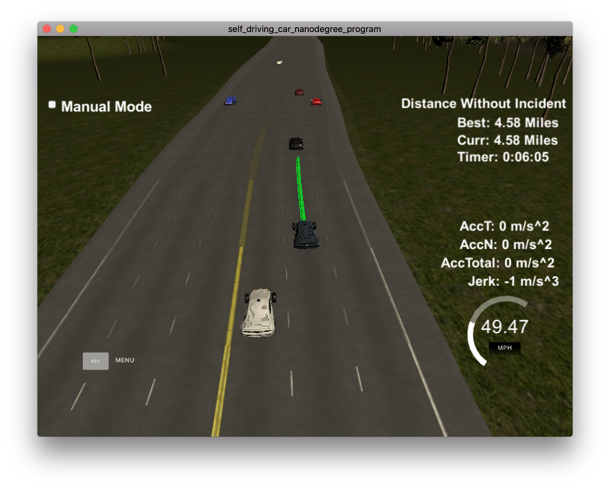

# CarND-Path-Planning-Project
Self-Driving Car Engineer Nanodegree Program

### Goals
In this project the goal is to safely navigate around a virtual highway with other traffic that is driving +-10 MPH of the 50 MPH speed limit. You will be provided the car's localization and sensor fusion data, there is also a sparse map list of waypoints around the highway. The car should try to go as close as possible to the 50 MPH speed limit, which means passing slower traffic when possible, note that other cars will try to change lanes too. The car should avoid hitting other cars at all cost as well as driving inside of the marked road lanes at all times, unless going from one lane to another. The car should be able to make one complete loop around the 6946m highway. Since the car is trying to go 50 MPH, it should take a little over 5 minutes to complete 1 loop. Also the car should not experience total acceleration over 10 m/s^2 and jerk that is greater than 50 m/s^3.

### Rubric points

#### The car is able to drive at least 4.32 miles without incident.

As in the following screenshot from the simulator, the car is able to drive for 4.32 miles without exceeding acceleration/jerk/speed, collision, and driving outside of the lanes.



#### The car drives according to the speed limit.

The car always try to reach the target speed (50 MPH) unless there a slower vehicle in front. If the current lane is free, then the speed is incremented according to the acceleration limit, as seen in this code snippet. 

```
} else if (v <= (target_speed)) {
    cout<< "Free lane!" <<endl;
    v += (.1 * max_acceleration);
}
```

#### Max Acceleration and Jerk are not Exceeded.

The acceleration and jerk limits are imposed in different situations, as follows:

* Accelerating in free lane

```
} else if (v <= (target_speed)) {
    cout<< "Free lane!" <<endl;
    v += (.1 * max_acceleration);
}
```

* Reducing speed to match speed of slower car in front:

```
// maximum 's' to safely stay behind the front car 
double safe_s = leading_s - safe_distance;
// speed difference between front car and ego
double delta_speed = fabs(v - leading_speed);

if (v >= leading_speed) {
    // linearly matches front vehicle speed
    v -= (delta_speed/safe_distance * (s - safe_s));
}
```

* Interpolating points using splines for smooth paths:

```
vector<double> ptsx;
vector<double> ptsy;

double pos_x = car_x;
double pos_y = car_y;
double angle = deg2rad(car_yaw);

int path_size = previous_path_x.size();

// get past 2 points
if (path_size < 2)
{
    double prev_car_x = car_x - cos(car_yaw);
    double prev_car_y = car_y - sin(car_yaw);
    ptsx.push_back(prev_car_x);
    ptsx.push_back(car_x);
    ptsy.push_back(prev_car_y);
    ptsy.push_back(car_y);
}
else
{
    pos_x = previous_path_x[path_size - 1];
    pos_y = previous_path_y[path_size - 1];

    double pos_x2 = previous_path_x[path_size - 2];
    double pos_y2 = previous_path_y[path_size - 2];
    angle = atan2(pos_y - pos_y2, pos_x - pos_x2);

    ptsx.push_back(pos_x2);
    ptsx.push_back(pos_x);
    ptsy.push_back(pos_y2);
    ptsy.push_back(pos_y);
}

double ego_d = ego.lane_width * ego.lane + ego.lane_width/2.;

float delta_s = 30.;
float add_s = 20 + delta_s;

// creating evenly spaced points ahead of the starting reference
for (int i=0; i < 4; i++) {
    vector<double> next_wp = getXY(car_s + add_s, ego_d, map_waypoints_s, map_waypoints_x, map_waypoints_y);
    ptsx.push_back(next_wp[0]);
    ptsy.push_back(next_wp[1]);
    add_s += delta_s;
}

// changing coordinates to ego's reference
for (int i=0; i < ptsx.size(); i++) {
    double shift_x = ptsx[i] - pos_x;
    double shift_y = ptsy[i] - pos_y;

    ptsx[i] = shift_x * cos(0-angle) - shift_y * sin(0-angle);
    ptsy[i] = shift_x * sin(0-angle) + shift_y * cos(0-angle);
}

// create spline
tk::spline s;

s.set_points(ptsx, ptsy);
```

* Avoid two lane changes in short period:

```
// The car must drive at least 'safe_distance' to change lanes again
if ((s - last_lane_change_s) > safe_distance &&  
    (cost_right < cost_center || cost_left < cost_center)) {

    if (cost_right < cost_left) {
        last_lane_change_s = s;
        lane++;
    
    } else if (cost_left < cost_center) {
        last_lane_change_s = s;
        lane--;
    }
}
```

#### Car does not have collisions.

The method `Vehicle::process_sensor_data` keeps track of all the vehicles inside a "risk distance":
This information is used to change lanes only when the desired lane is safe and to reduce the speed
when the front vehicle is slower.

```
void Vehicle::process_sensor_data(map<int, vector<vector<double>>> predictions) {

    map<int, vector<vector<double>>>::iterator it = predictions.begin();
    in_front = {};
    left_front = {};
    right_front = {};
    left_collision = {};
    right_collision = {};

    while(it != predictions.end())
    {
    	int v_id = it->first;
        vector<vector<double>> vec = it->second;
        //cout<< "Vehicle: " << v_id << " => " <<  vec[0][0] << "; " << vec[0][1] << endl;

        if((get_lane(vec[0][1]) == lane) && (vec[0][0] > s))
        {
            in_front.push_back(vec);
            
        } else if((get_lane(vec[0][1]) == lane + 1) && (vec[0][0] > s - safe_distance/2.)) {

            if (vec[0][0] > s + safe_distance/2.) {
                right_front.push_back(vec);

            } else {
                right_collision.push_back(vec);
            }
        
        } else if((get_lane(vec[0][1]) == lane - 1) && (vec[0][0] > s - safe_distance/2.)) {
        	if (vec[0][0] > s + safe_distance/2.) {
                left_front.push_back(vec);

            } else {
                left_collision.push_back(vec);
            }
        }

        it++;
    }

    cout<< "Left front: "<< left_front.size() << endl;
    cout<< "Left collision: "<< left_collision.size() << endl;
    cout<< "Center front: "<< in_front.size() << endl;
    cout<< "Right front: "<< right_front.size() << endl;
    cout<< "Right collision: "<< right_collision.size() << endl;
}
```

#### The car stays in its lane, except for the time between changing lanes.

This is easy to accomplish using Frenet coordinates. We only need to update
the Vehicle::lane property and then calculate the 'd' coordinate using lane width information.
This 'd' value is used to generate the trajectory using `spline.h`.

```
// creating evenly spaced points ahead of the starting reference
double ego_d = ego.lane_width * ego.lane + ego.lane_width/2.;

float delta_s = 30.;
float add_s = 20 + delta_s;

for (int i=0; i < 4; i++) {
    vector<double> next_wp = getXY(car_s + add_s, ego_d, map_waypoints_s, map_waypoints_x, map_waypoints_y);
    ptsx.push_back(next_wp[0]);
    ptsy.push_back(next_wp[1]);
    add_s += delta_s;
}
```

#### The car is able to change lanes.

To change lanes, we calculate the cost of staying in the current lane x changing left or right.
The cost is proportional to the absolute difference between the speeds of all cars in the lane and 
the ego. It is also inversely proportional do the square of the distance to the vehicles. This way 
we disencourage changing lanes too soon.

```
if (s > safe_s && in_front.size() > 0) {

    double cost_left = 10000000;
    double cost_right = 10000000;

    if (left_collision.size() == 0 && lane > 0) {
        cost_left = 0;
        if (left_front.size() > 0) {
            for(int i = 0; i < left_front.size(); i++)
            {
                cost_left += fabs(left_front[i][0][2] - v) / pow((left_front[i][0][0] - s), 2);
            }

            cost_left /= left_front.size();
        }
    }

    if (right_collision.size() == 0 && lane < lanes_available - 1) {
        cost_right = 0;
        if (right_front.size() > 0) {
            for(int i = 0; i < right_front.size(); i++)
            {
                cost_right += fabs(right_front[i][0][2] - v) / pow((right_front[i][0][0] - s), 2);
            }

            cost_right /= right_front.size();
        }
    }

    if ((s - last_lane_change_s) > 3 * safe_distance &&  
        (cost_right < cost_center || cost_left < cost_center)) {

        if (cost_right < cost_left) {
            last_lane_change_s = s;
            lane++;
        
        } else if (cost_left < cost_center) {
            last_lane_change_s = s;
            lane--;
        }
    }
}
```